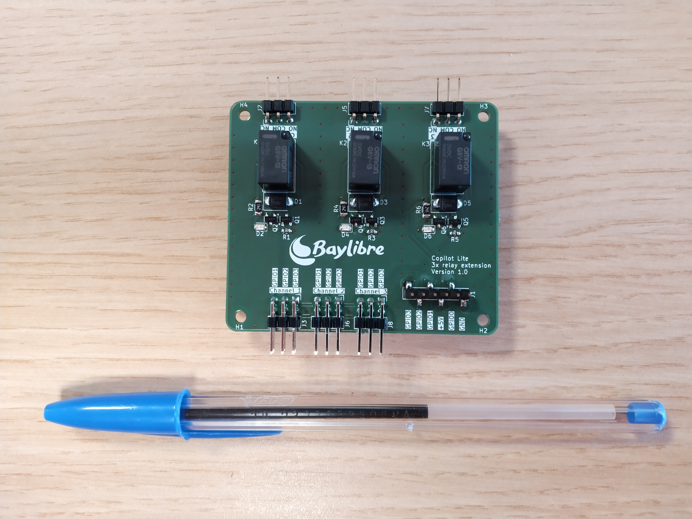

# Copilot Lite - 3x signal relays extension board

This boards mounts on top of the Copilot Lite board, like a Raspberry Pi hat or an Arduino shield.

It provides 3 signal relays which can be controlled by a Copilot Lite GPIO.  
The GPIO controlling each relay can be configured through jumpers.

## Caution
* The board can drive up to 1A @ 48VDC per relay.
* **The board is *NOT* designed to drive mains AC voltages.** 